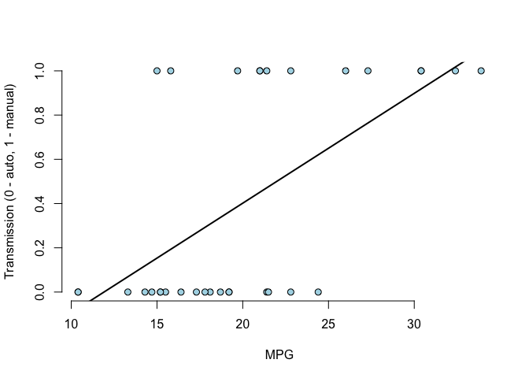

JHU - Coursera - Regression Models Course Project
=================================================

Kaloyan Atanasov

04/17/2018

Executive Summary:
------------------

The following analysis is done on the "mtcars" data, as part of the R "datasets" package. The current Regression Models Course Project tests linear regression against generalized linera model. It proves that a Logistic Regression model best interprets the relationship between the type of transmission, automatic or manual, and the fuel efficiency, or the miles per gallon. The model shows the probability of transmission change as MPG increases or decreases, i.e. the percentage probability of a transmission type for every additional mile per gallon that a vehicle achieves.

Analysis:
---------

First, let's load the data set and review the information about the different variables.

``` r
data("mtcars")
?mtcars
```

Next, let's take a look at the structure of the data set.

``` r
str(mtcars)
```

    ## 'data.frame':    32 obs. of  11 variables:
    ##  $ mpg : num  21 21 22.8 21.4 18.7 18.1 14.3 24.4 22.8 19.2 ...
    ##  $ cyl : num  6 6 4 6 8 6 8 4 4 6 ...
    ##  $ disp: num  160 160 108 258 360 ...
    ##  $ hp  : num  110 110 93 110 175 105 245 62 95 123 ...
    ##  $ drat: num  3.9 3.9 3.85 3.08 3.15 2.76 3.21 3.69 3.92 3.92 ...
    ##  $ wt  : num  2.62 2.88 2.32 3.21 3.44 ...
    ##  $ qsec: num  16.5 17 18.6 19.4 17 ...
    ##  $ vs  : num  0 0 1 1 0 1 0 1 1 1 ...
    ##  $ am  : num  1 1 1 0 0 0 0 0 0 0 ...
    ##  $ gear: num  4 4 4 3 3 3 3 4 4 4 ...
    ##  $ carb: num  4 4 1 1 2 1 4 2 2 4 ...

First, we apply a basic scatterplot of the data using the "GGally" package. The following code generates a pairs plot of all the variables in the data set.

``` r
library(ggplot2)
library(GGally)

g <- ggpairs(mtcars, lower = list(continuous = "smooth"), axisLabels = "internal")
g
```


As the plot above shows, the corresponding upper triangular part of this matrix, one for each pair of variables, gives the empirical correlation between those two variables. The graph of each pair of variables shows the Lowess Smoothing line, which helps us visualize the correlation. We can also see a prediction confidence interval, the grey area arround each of the Lowess Smoothing lines. Once we got an idea, and a snapshot, of the empirical correlation between each pair of variables, let's continue to investigate.

#### "Is an automatic or manual transmission better for MPG"

One way to approach this question is through fitting a model that will determine whether certain transmission is automatic or manual, given a particular MPG. In other words, we want to predict the type of transmission, the "am" variable as an outcome, by having the fuel efficiency, the "mpg" variable as a predictor.

Even though we clearly deal with binary outcome, let's start with testing a linear regression. It is something that we can do first, before we move on to a logistic regression model.

``` r
fit1 <- lm(am ~ mpg, data = mtcars)

summary(fit1)$coef
```

    ##                Estimate Std. Error   t value     Pr(>|t|)
    ## (Intercept) -0.59149275 0.25335941 -2.334599 0.0264482134
    ## mpg          0.04966211 0.01209463  4.106127 0.0002850207

Let's plot the results and visualize what we achieved with the linear regression. The following code sets the plot and adds the regression line from our model.

``` r
plot(mtcars$mpg, mtcars$am,
     xlab = "MPG", ylab = "Transmission (0 - auto, 1 - manual)",
     bg = "lightblue", col = "black",
     cex = 1.1, pch = 21,
     frame.plot = FALSE)

abline(fit1, lwd = 2)
```



It already appears that linear regression is not the right approach for binary outcome. However, let's make sure by plotting the residuals and look for pattern, which will furhter prove our point.

The following code sets the plot of residuals and adds the a horisontal line at 0.

``` r
plot(mtcars$mpg, resid(fit1),
     xlab = "MPG", ylab = "Residuals Transmission",
     bg = "lightblue", col = "black",
     cex = 2, pch = 21, frame.plot = FALSE)

abline(h = 0, lwd = 2)
```


The plot above clearly shows a pattern in the residual variation. Since the residuals in the linear regression model should be mostly patternless, this proves that the linear regression mdoel that we tested was not what we need.

Next, let's explore the generalized linear models (GLMs) and fit a Logistic Regression model. Again, we want to predict the type of transmission, the "am" variable as an outcome, by having the fuel efficiency, the "mpg" variable as the predictor.

``` r
fit2 <- glm(am ~ mpg, data = mtcars, family = "binomial")

summary(fit2)$coef
```

    ##               Estimate Std. Error   z value    Pr(>|z|)
    ## (Intercept) -6.6035267  2.3514416 -2.808289 0.004980557
    ## mpg          0.3070282  0.1148416  2.673493 0.007506579

Analysing the results, in terms of coefficients, in this case, on the logit scale, considering the MPG coefficient, we want to see whether it is close to 0 or not. In this case it is 0.3.

Next, let's plot the predicted responses put back on the probability scale.

``` r
plot(mtcars$mpg, fit2$fitted.values,
     xlab = "MPG", ylab = "Prob Auto. or Man.",
     pch = 19, col = "blue")
```


Analysing the plot, we took the MPG, or the X variable associated with the coefficient, R multiplied it times the coefficient for the MPG, added the estimated intercept and took e to that value over one plus e to that value. The s-curve is the fitted function. This is logisitc regression model, but converted back to the probability scale, which gives us the probabilities.

Let's remind ourselves that 0 stands for automatic and 1 for manual transmission. As the plot shows, as the MPG increases the probability of the transmission to be manual increases as well.

#### "Quantify the MPG difference between automatic and manual transmissions"

Next, if we want to exponentiate the model's coefficients, we get the following results.

``` r
exp(fit2$coefficients)
```

    ## (Intercept)         mpg 
    ## 0.001355579 1.359379288

The above result suggests a 36% probability of a transmission to be manual for every additional mile per gallon that a vehicle achieves.

Next, in order to test, we can get the confidence intervals of the two coefficients above, with the "confint" function from the MASS library.

``` r
library(MASS)
```

    ## Warning: package 'MASS' was built under R version 3.4.3

``` r
exp(confint(fit2))
```

    ## Waiting for profiling to be done...

    ##                    2.5 %     97.5 %
    ## (Intercept) 4.425443e-06 0.06255158
    ## mpg         1.129764e+00 1.79946863

As the result shows, the interval goes from 0 to 1.8, which does contain the previously mentioned coefficient of 1.36.

Last but not least, we can test the importance of MPG by using the "anova" function, as follows.

``` r
anova(fit2, test = "Chisq")
```

    ## Analysis of Deviance Table
    ## 
    ## Model: binomial, link: logit
    ## 
    ## Response: am
    ## 
    ## Terms added sequentially (first to last)
    ## 
    ## 
    ##      Df Deviance Resid. Df Resid. Dev  Pr(>Chi)    
    ## NULL                    31     43.230              
    ## mpg   1   13.555        30     29.675 0.0002317 ***
    ## ---
    ## Signif. codes:  0 '***' 0.001 '**' 0.01 '*' 0.05 '.' 0.1 ' ' 1

Analysing the result, the p-value is less than 0.05, which means that we have strong evidence against the null hypothesis that the predictor "mpg" is insignificant, i.e. we reject the null hypothesis, which in turns shows that the inclusion of MPG appears to be necessary.

Conclusion:
-----------

After testing linear regression against generalized linera model, we proved that the Logistic Regression best interprets the relationship between the type of transmission, automatic or manual, and the fuel efficiency, or the miles per gallon.

The model clearly showed that as the MPG increases the probability of the transmission being manual increases as well, which in turn means that manual transmission is better for MPG, since there is a 36% probability of a transmission to be manual for every additional mile per gallon that a vehicle achieves.
